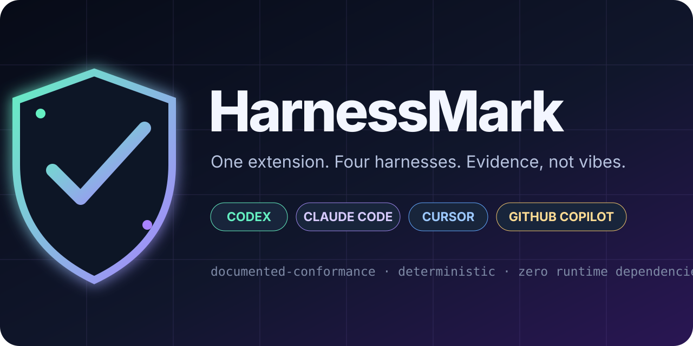

<p align="center">
  
</p>

<p align="center">
  <a href="https://github.com/Dean00dev/HarnessMark/actions/workflows/ci.yml"></a>
  
  
  <a href="LICENSE"></a>
</p>

# HarnessMark

**Playwright-style conformance testing for AI-agent extensions.** Prove that a skill, plugin, hook or instruction pack matches every harness it claims to support—before users discover the drift for you.

Agent extensions are becoming packages, but compatibility claims are still usually prose. The same skill can be mirrored across `.agents`, `.claude`, `.cursor` and `.github`; one copy changes, a hook event is cased for the wrong host, or a rule sits in a path its target silently ignores. HarnessMark turns those claims into a deterministic test matrix.

```console
$ harnessmark check ./my-extension

HOST              STATUS  ARTIFACTS  CLAIMED
----------------  ------  ---------  -------
Codex             PASS            4  yes
Claude Code       PASS            4  yes
Cursor            PASS            5  yes
Gemini CLI        PASS            6  yes
GitHub Copilot    PASS            7  yes

Result: PASS · 0 errors · 0 warnings
```

> **The honest boundary:** this is documented conformance, not behavioral proof. HarnessMark can show that bytes and paths match current first-party formats. It cannot prove that a host loaded them or that a model followed them.

## What it catches

- invalid Agent Skill names, frontmatter and directory-name mismatches;
- mirrored `SKILL.md` copies that have silently drifted;
- claimed hosts with no discoverable artifact;
- Agent Plugin and host-plugin manifest defects;
- component paths that escape the package or do not exist;
- unsupported or wrongly cased hook events;
- malformed Gemini CLI extension manifests and unsafe or missing context paths;
- hook commands pointing at missing project files;
- shell assumptions that reduce Windows portability;
- Cursor `.md` rules that look valid but are ignored in `.cursor/rules`;
- missing `applyTo` or invalid `excludeAgent` in Copilot path instructions;
- empty instruction files and symlink uncertainty;
- compatibility-contract drift against a reviewed Conformance Lock.

It never runs inspected hooks, scripts, MCP servers or extension code.

## Quick start

### GitHub Action

```yaml
permissions:
  contents: read

steps:
  - uses: actions/checkout@11d5960a326750d5838078e36cf38b85af677262 # v4.4.0
  - name: Test agent-extension compatibility
    uses: Dean00dev/HarnessMark@v1.1.0
    with:
      path: .
      config: harnessmark.yml
      format: sarif
      output: harnessmark.sarif
      fail-on: error
```

The Action writes a compatibility table to the workflow summary and exposes `result`, `errors`, `warnings` and `report` outputs. Version 1 also exposes deterministic lock state through `lock-digest`, `lock-events`, and `lock-drift`.

### From this source tree

```console
node src/cli.js check ./my-extension
node src/cli.js check ./my-extension --format html --output passport.html
```

The CLI is dependency-free on Node 20 or newer. The repository package is npm-compatible, but the GitHub release remains the canonical distribution until an npm publication is explicitly announced.

## Compatibility passport

One scan can render five views of the same result:

| Format | Use |
|---|---|
| terminal table | fast local diagnosis |
| JSON | integrations and longitudinal comparison |
| JUnit | test dashboards |
| SARIF 2.1 | code-scanning ingestion |
| standalone HTML | shareable compatibility passport |

Each report carries the ruleset version, evidence-review date, assurance boundary and deterministic SHA-256 fingerprint of scanned inputs. HarnessMark does not add a “generated at” timestamp, so identical inputs produce comparable artifacts.

## Conformance Lock

A normal scan tells you whether the package conforms **now**. A Conformance Lock tells you whether the compatibility state changed after review.

```console
# Establish the reviewed baseline.
harnessmark check . --write-lock harnessmark.lock.json

# Later: compare current compatibility and fail on any drift.
harnessmark check . \
  --compare-lock harnessmark.lock.json \
  --fail-on-lock-drift any
```

The lock captures claimed hosts, discovered artifacts, host status, core portable artifacts and deterministic findings. It carries a SHA-256 `contractDigest`; malformed or digest-tampered locks are rejected instead of silently trusted.

HarnessMark's own version is recorded as provenance but excluded from the compatibility digest. A tool-only patch upgrade therefore does not create drift unless the resulting compatibility state changes.

Read the [Conformance Lock contract](docs/CONFORMANCE_LOCK.md) before using it as a merge gate.

## Why this is different

| Tool category | Main question |
|---|---|
| format converter | “Can I copy this extension into another layout?” |
| security scanner | “Does this code contain a known risk?” |
| prompt evaluator | “How did a model respond?” |
| **HarnessMark** | **“Does this package match every documented harness contract it claims?”** |

HarnessMark validates the shared [Agent Skills](https://agentskills.io/specification) and [Agent Plugins](https://agent-plugins.org/specification) cores, then applies host-specific rules sourced from Codex, Claude Code, Cursor, Gemini CLI and GitHub Copilot documentation.

## Configuration

```yaml
schema: 1
name: my-portable-extension
root: .
targets:
  - codex
  - claude-code
  - cursor
  - gemini-cli
  - github-copilot
fail_on: error
```

See [configuration](docs/CONFIGURATION.md), [rule catalog](docs/RULES.md), [adapter contract](docs/ADAPTERS.md), [evidence ledger](docs/EVIDENCE.md), [Conformance Lock](docs/CONFORMANCE_LOCK.md), [threat model](docs/THREAT_MODEL.md), and the [verification receipt](docs/VERIFICATION_RECEIPT.md).

## Verification

```console
node --test
node scripts/run-campaign.js
node src/cli.js check fixtures/portable-extension --config fixtures/portable-extension/harnessmark.yml
```

The campaign includes isolated defects for invalid skill names, mirror drift, path escape, unsupported hooks, ignored Cursor rules, malformed Copilot path instructions, and Gemini CLI manifest, context-path, and hook-event failures. The v1 test suite additionally exercises deterministic locks, tamper rejection, severity-specific drift gates, CLI round-trips and Action lock outputs across the hosted platform matrix.

See the receipt before treating any unexecuted platform claim as established.

## Contributing

The highest-value contribution is a minimal fixture showing where HarnessMark disagrees with first-party behavior. New adapters require first-party documentation and both positive and negative fixtures. See [CONTRIBUTING.md](CONTRIBUTING.md).

Apache-2.0 licensed. Built by Dean Egan as an open conformance layer for the rapidly fragmenting agent-extension ecosystem.
